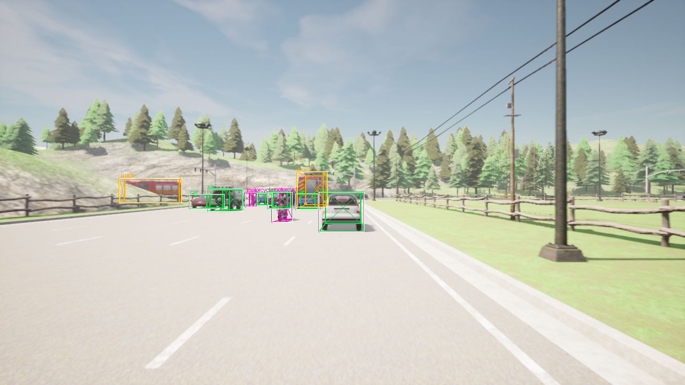
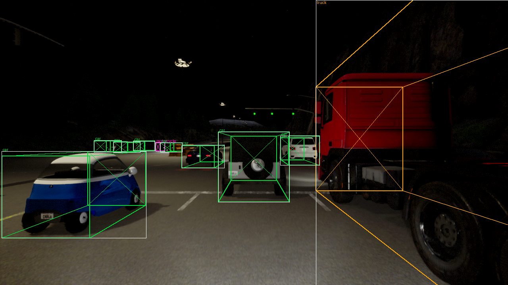

# Cloud-Native AV Perception Stack

**A highway perception stack split across an onboard real-time tier and an AWS near-real-time tier, built to measure whether delayed cloud perception is still safe to act on.**


<!-- Replace with the Phase 5 live-overlay clip once it exists; these stills are
     the Phase 1 stand-in. Regenerate per docs/media/README.md. -->

| | |
|---|---|
|  |  |

*Ground truth as written to disk, drawn back onto the image. The white rectangle is the KITTI 2D box; the coloured wireframe is the 3D cuboid **rebuilt from the written `(h, w, l, x, y, z, rotation_y)` and `P2`**, which round-trips the writer's own conventions; the cross marks the facing end, because a wireframe box is symmetric and a 180° yaw error would otherwise render perfectly. Colours are per class — car, truck, van, motorcycle. Night scenes are lit only by vehicle headlights, which CARLA leaves off by default.*

A simulated sedan drives a highway in CARLA. The perception that interprets what it sees is deliberately split in two: **lane geometry runs onboard** under a real-time budget (<100 ms), while **vehicle detection, tracking, and lead-vehicle distance run in the cloud** under a near-real-time budget (<5 s).

The models are not the point. The point is that a cloud answer describes a moment that has already passed, and this project measures how much that costs.

---

## Contents

- [The question](#the-question)
- [Status](#status)
- [Architecture](#architecture)
- [The dataset (data card)](#the-dataset-data-card)
- [Reproducing it](#reproducing-it)
- [Repository layout](#repository-layout)
- [Design decisions and tradeoffs](#design-decisions-and-tradeoffs)
- [Known limitations](#known-limitations)
- [Roadmap](#roadmap)

---

## The question

Running perception on the vehicle means paying for a GPU in every vehicle. Running it in the cloud is far cheaper per unit of compute, but you pay in latency and connectivity risk.

Rather than picking a side, this project holds model strength fixed, runs the full-strength model in the cloud, and measures the thing that actually gates the decision: **by the time the answer arrives, the world has moved.**

At 100 km/h the ego covers about 28 m per second. A 2 second round trip means the answer that just landed describes a scene from roughly 56 m ago. So each cloud output is scored on **end-to-end age** and on the error that age introduces:

| Output | Delay-induced error metric | Why this metric |
|---|---|---|
| Lead-vehicle distance | `abs(reported(t) - ground_truth(t_consumed))` in meters, bucketed by relative velocity | Continuous quantity, and staleness scales with closing speed, not ego speed |
| Vehicle tracks | IoU and box-center drift vs current ground truth, plus track ID consistency | Spatial error, and an ID that flips mid-wait breaks anything downstream |

Every logged inference carries `(accuracy, age, delay_induced_error, cost)`, so the usability curve is plotted rather than asserted. The deliverable is a per-output verdict on **which perception outputs can honestly live in the cloud tier and which must stay onboard**, against a usability threshold fixed in advance.

This is only measurable because the dataset records a **fully timestamped ground-truth timeline**, letting a stale output be scored against what was true when it was *consumed*, not when it was *computed*.

---

## Status

Built in phases, each with a written definition of done before any code. The phase docs live in this repo and are the design record.

| Phase | Scope | State |
|---|---|---|
| 0 | Frame the problem, lock scope and narrative | Complete |
| 1 | CARLA capture pipeline plus labeled KITTI dataset | Complete - 8,400 frames, 14,396 objects |
| 2 | Train and validate the detector locally | In progress |
| 3 | Move training to AWS, versioned and tracked | Planned |
| 4 | Serve as a real inference endpoint | Planned |
| 4b | Same ONNX model on a Raspberry Pi, benchmarked head to head | Planned |
| 5 | Close the loop, CARLA to AWS in real time, with delay telemetry | Planned |
| 6 | Monitoring, IaC, CI/CD, automated teardown | Planned |
| 7 | Demo, docs, write-up | Planned |

Full phase definitions: [Project Outline.md](./Project%20Outline.md) · [Phase 0.md](./Phase%200.md) · [Phase 1/Phase 1.md](./Phase%201/Phase%201.md)

---

## Architecture

```
  ── ONLINE PATH (Phase 5) ───────────────────────────────────────────────────
  CARLA (Python client)        onboard tier
  ├─ ego sedan + traffic  ───►  lane geometry  ──────────► <100 ms ──┐
  ├─ RGB / depth /                                                   │
  │  instance-seg cams         ingestion (HTTP | Kinesis | MQTT)     │
  ├─ 64-ch LiDAR         ───►   ─────────────┐                       │
  └─ IMU / GNSS                              ▼                       ▼
                                   AWS inference service      live overlay
                                   detect ─► track ─► dist    + telemetry
                                             │                       ▲
                                             └─ staged timestamps ────┘
                                                (capture, encode, up,
                                                 infer, down, consumed)

  ── OFFLINE PATH (Phases 1-3, built first) ──────────────────────────────────
  CARLA on EC2 g4dn spot ─► raw capture ─► local NVMe ─► CPU offline processing
   (GPU container)                                          ├─ project boxes to 2D/3D
                                                            ├─ occlusion + frustum filter
                                                            ├─ KITTI packaging + splits
                                                            ├─ data card + histogram
                                                            └─► S3 (versioned dataset)
                                                          │
                                                          ▼
                                                cloud training ─► artifact
```

The offline path is built first, because the online loop has nothing to serve without it.

**Cost-driven split.** CARLA is a GPU renderer, so the GPU container does only what needs a GPU: drive the scenarios and dump raw sensor buffers with unfiltered labels. Every CPU-bound step (projection, occlusion filtering, class mapping, packaging) runs in a separate CPU-only container, so every offline decision is re-runnable without touching the GPU again.

**Raw never leaves the box.** It is written to the instance store, read by the processing container off local disk, and discarded with the instance; only the finished dataset is published. Uploading it would mean roughly 200k PUTs for data the next stage reads locally anyway. The tradeoff is explicit: re-tuning a filter threshold is free while the instance lives and costs a re-capture afterwards, so the sample renders get checked before the box is released.

---

## The dataset (data card)

`carla_highway_perception_v1`. Generated from the sim, labeled from the sim, KITTI on-disk format.

### Scenario matrix

14 scenes, 300 s each, captured at **2 Hz** from a 20 Hz simulation. Consecutive 20 Hz frames at highway speed are near-duplicates: they inflate frame count without adding information and they leak across splits.

| Split | Maps | Conditions | Scenes | Frames |
|---|---|---|---|---|
| train | Town04, Town06 | day + night, low + high density | 8 | 4,800 |
| val | Town04, Town06 | unseen routes and seeds, **mid** density (unseen in train) | 4 | 2,400 |
| test | **Town05** | held-out map, day + night | 2 | 1,200 |
| **total** | | | **14** | **8,400** |

**Splits are assigned per scene, never per frame.** Test is an entirely held-out map, so the generalization probe is geometry the model has never seen. Per-scene config (routes, seeds, weather, density, target speed) is in [scene_description.json](./Phase%201/config/scene_description.json).

The split is recorded twice on purpose: once per scene, and once on the **run** that captured it. Runs are split-pure, and the processor refuses to start if the two records disagree, because "no scene spans two splits" is the claim that makes the test number mean anything. Val carries four scenes rather than two because the first full run left it too thin to measure the rarer vehicle classes.

### Sensor rig

Rig `front_v1`, fixed across every scene. Ego is a fixed `vehicle.tesla.model3`: swapping the ego between runs would change camera height and mounting geometry, which is a distribution confound rather than useful diversity.

| Sensor | Spec | Role |
|---|---|---|
| `cam_front` | RGB, 1280x720, 90 deg FOV, at (1.5, 0, 1.6) m | Detector input |
| `cam_front_instance_seg` | co-located with `cam_front` | Semantic tag per pixel, plus an opaque separator between overlapping same-class vehicles |
| `cam_front_depth` | co-located with `cam_front` | **The occlusion oracle.** Planar depth, verified against LiDAR |
| `lidar_top` | 64 ch, 100 m, 1.3 M pts/s, 20 Hz rotation, at (0, 0, 1.8) m | Lead-vehicle distance; rotation pinned to sim rate so exactly one sweep completes per tick |
| `imu`, `gnss` | ego origin | Ego state only, never a perception input |

Camera intrinsics are **derived** from width/height/FOV rather than stored beside them, because storing both invites drift. Full rig and extrinsic conventions: [ego_config.json](./Phase%201/config/ego_config.json).

### Labels

Ground truth comes directly from the sim: vehicle boxes from `actor.bounding_box`, composed to world frame at capture time.

Capture-time records are **deliberately unfiltered**. Every actor CARLA reports is written, including occluded and out-of-frustum ones, and there is no `visible` field in the schema. Visibility is derived offline, so the filter threshold stays re-tunable without regenerating GPU-hours of data.

Class names are likewise not baked in. Each object stores `blueprint_id`, `base_type`, and `listed_speed_kph`; the KITTI writer applies a class map chosen from four presets, and re-mapping is a free offline re-run. The active preset is **`vehicles_only`** (car, truck, van, motorcycle) — see [Known limitations](#known-limitations) for why signs were dropped. `fine`, `coarse` and `merged_signs` remain in config, one edit away.

That knob earned its keep: dropping signs from the label set cost one config edit and an offline re-run, with no re-capture, because signs are still recorded in the raw capture.

**Beyond the KITTI fields.** `label_2` carries the standard 15 columns, and `frame_index.json` carries what KITTI has nowhere to put:

| Field | Why it is there |
|---|---|
| `ego_pose` | Position, rotation and velocity per frame. A stale detection can only be scored against what was true when it was *consumed* if the ego trajectory is recoverable, and raw is discarded with the instance |
| `track_ids` | Ground-truth identity, aligned row-for-row with `label_2`. KITTI detection has no identity column and its 16th field means confidence, so an ID there would be read as a score |
| `timestamp_sim_s` | Sim time, not wall clock, so the timeline is exact and reproducible |

See [CARLA_config.json](./Phase%201/config/CARLA_config.json) and the annotated per-frame schema in [dataset_example.json](./Phase%201/config/dataset_example.json).

### Per-class instance counts

<!-- Regenerate with: process.py --report-only --output-root <root> -->

Written by every processing pass to `class_histogram.md`, alongside the dataset. Target is 500 to 1500 instances per class, and the table scores **volume and per-split coverage independently** — a class can clear the total and still be unmeasurable, because a split holding a handful of instances yields an AP that is noise rather than a measurement. The floor is 50 per split.

**8,400 frames, 14,396 labelled objects.**

| class | test | train | val | total |
|---|---|---|---|---|
| `car` | 1,217 | 5,982 | 2,492 | **9,691** |
| `truck` | 421 | 1,765 | 619 | **2,805** |
| `van` | 353 | 536 | 145 | **1,034** |
| `motorcycle` | 100 | 495 | 271 | **866** |

Every class clears the target and is present in every split. `car` and `truck` run over the 1,500 ceiling, which is left as-is: they are the classes highway traffic actually produces, and discarding real instances to hit a number would trade information for tidiness.

The two extra val scenes exist because of this table. A first 12-scene run put `motorcycle` at **7** instances in val and `van` at **49** — healthy totals hiding a split that could not measure either class. Adding two val scenes moved them to 271 and 145.

The histogram is the input to the top-up loop: process, read it, and if a class is thin, capture a split-pure run that produces it and mine only the frames carrying that class. Top-ups append to the tree in place, and they drag co-occurring classes along with them, so the table is re-read each round rather than extrapolated.

### Encoded buffers, read this before decoding

CARLA's depth and instance-segmentation cameras **do not emit literal images**. They pack values into RGB channels, and reading them as ordinary images yields garbage.

```
depth_m     = 1000 * (R + G*256 + B*256**2) / (256**3 - 1)   # planar, 1000 m far plane
semantic_id = R                                              # 14 Car, 15 Truck, 18 Motorcycle...
instance_id = (G * 256) + B                                  # opaque, NOT carla actor.id
```

Both **must** be stored as lossless PNG with no `ColorConverter` applied. JPEG would corrupt the packed channel values and silently break both decodes, and CARLA's depth converters are visualization helpers that discard precision.

Three conventions here were verified against captured data rather than assumed, because each is a silent wrong-label bug if guessed:

- **The instance ID is not `actor.id`.** The config originally asserted it was. Vehicle pixels decode to IDs like 19409 under *both* byte orders while the recorded actor IDs for those frames were 277-306 — it is an engine-side ID with no route back to the Python actor. That killed the planned visibility filter and is why depth became the occlusion oracle, with the instance ID demoted to separating two same-class vehicles whose boxes overlap.
- **Depth is planar, not radial.** Projecting LiDAR into the camera and comparing gives `buffer/planar = 1.0000` against `buffer/radial = 0.88`. At 90 degrees FOV the two differ by up to 41% at the image edge.
- **The LiDAR `.npy` needs no y-flip** to sit in the camera's frame: 91-96% of points agree with the depth buffer unflipped, against 37-52% flipped. The flip happens later, on the way to KITTI's right-handed velodyne frame.

### Provenance

Every capture run stamps: git commit, SHA256 of each config file as it existed at generation time, the CARLA version the server actually reported (checked against the pin, since a mismatch is a real bug), Python version and wheel, AMI, region, GPU hours, estimated cost, and any spot interruptions. Schema in [metadata.json](./Phase%201/config/metadata.json).

Every processing pass adds a `dataset_summary.json` recording the config hashes, the class map preset, and **the visibility thresholds by value**. Those thresholds live in code rather than config, so without them the counts are not reproducible: what counts as "visible" is part of the dataset's definition, not an implementation detail.

The S3 prefix is versioned (`processed/<name>/<version>/<split>/`). Publishing under the same version overwrites and prunes to mirror what was just written; bumping it preserves the previous dataset, so there is always a way back to the exact data a model was trained on.

### Sim-to-real disclaimer

Everything here is simulator-generated and simulator-labeled. Reported results are sim results. Real-world performance is **untested**, not implied.

---

## Reproducing it

> **Cost warning.** Capture needs an NVIDIA GPU. CARLA renders camera and LiDAR on the GPU even when headless, so there is no CPU-only capture path. On `g4dn.xlarge` spot this runs roughly 0.15 to 0.20 USD/hr against 0.53 on demand, and a full matrix run lands in single-digit dollars. Set an AWS budget alarm before launching anything, and terminate when done.

### Prerequisites

- An AWS account with an EC2 G-instance **spot** quota of at least 4 vCPUs (approval can take a day)
- An S3 bucket in the same region as the instance, to avoid cross-region egress
- An EC2 instance profile granting S3 read/write, so no access keys ever land on the box (least-privilege policies in [AWS IAM/](./AWS%20IAM/))
- Docker with `nvidia-container-toolkit` on the instance

### 1. Bring up the CARLA server

A baked AMI (Deep Learning base AMI plus a pre-pulled `carlasim/carla:0.9.15`, 120 GB gp3 root) brings the box up in about two minutes instead of reinstalling drivers every session. Full runbook with the gotchas: [Phase 1/relaunch-carla.md](./Phase%201/relaunch-carla.md).

```bash
docker run -d --name carla --gpus all --net=host \
  carlasim/carla:0.9.15 ./CarlaUE4.sh -RenderOffScreen -nosound

docker logs --tail 30 carla     # UE4 boots, no fatal GPU/Vulkan errors
ss -tln | grep 2000             # RPC port open == server accepting clients
aws sts get-caller-identity     # ARN should read assumed-role/<ec2-role>/...
```

### 2. Run the pipeline

One orchestrator drives both halves. It starts the CARLA server, installs the additional maps if missing, builds both images, captures every run, processes each split, and publishes only the finished dataset.

```bash
cd "Phase 1"

# Subset smoke first: 5 frames per scene, local only. Proves the whole path
# across every scene for a few minutes of GPU.
bash orchestrate.sh

# Full matrix, published to S3.
FRAMES= UPLOAD=1 bash orchestrate.sh
```

Data goes to the **instance store** (`/opt/dlami/nvme`), not the EBS root: the workload is write-heavy and the raw frames are disposable by design. The script prints the chosen data root and its free space before doing any work, and falls back to EBS with a warning if the NVMe is not mounted. Note the instance store is lost on *stop* as well as terminate, so the S3 publish must succeed before the box is released.

Knobs: `FRAMES` (per-scene cap; empty means full), `UPLOAD`, `RUNS` (empty skips capture), `SPLITS` (empty skips processing), `VERSION`, `SAMPLES`, `DATA`.

### 3. Offline processing on its own

Processing needs no GPU and no CARLA, only the raw scratch directory, so it re-runs freely against an existing capture:

```bash
docker run --rm --net=host -v "$PWD":/workspace -v /opt/dlami/nvme/perception:/data   perception-offline:1.0   python -u src/process_data/process.py --split train   --raw-root /data/_scratch --output-root /data/kitti --version v2
```

One invocation is one split, selected by the run-level split flag. `--topup-class <class> --topup-frames N` switches to append mode: it scans for frames containing a starved class, samples them, and extends the tree in place. `--report-only` rebuilds the histogram from the summaries on disk, with no raw data needed at all.

### Verification ladder

Cheapest first, so failures surface before they cost money.

1. **Local, no GPU.** Configs load and strip; runs resolve to scene IDs; every run is split-pure and agrees with the per-scene split.
2. **Subset run.** `bash orchestrate.sh` proves capture, processing, splits and the S3 layout end to end across all 14 scenes for a few minutes of GPU.
3. **Writer/reader contract.** Stream that subset back and confirm depth and instance-seg decode without error.
4. **Empirical convention checks.** Resolve depth planar-vs-radial and the LiDAR handedness against each other, and `rotation_y` against recorded velocity: over 71 moving vehicles the heading implied by `rotation_y` agreed with the velocity vector to a mean of **0.31 degrees**, with nothing flipped 180.
5. **Render the cuboids.** `viz.py` rebuilds 3D boxes from the written `(h, w, l, x, y, z, rotation_y)` and `P2` and draws them on the images, which round-trips the writer's own conventions. A wireframe box is symmetric, so the facing end is drawn with a cross — otherwise a 180 degree yaw error renders perfectly. This is the check that catches what tests do not: a wrong convention still produces a well-formed label file.
6. **Map survey.** `survey_signs.py` walks the road graph from every spawn point and counts what each route passes, so scene routing is chosen from the map rather than guessed.

---

## Repository layout

```
.
├── Project Outline.md             # the seven-phase design brief and decision framework
├── Phase 0.md                     # problem framing, scope locks, the narrative
├── Phase 1/
│   ├── Phase 1.md                 # phase plan: decisions, definition of done, steps
│   ├── capture-design.md          # capture module design: concerns, lifecycle, layout
│   ├── relaunch-carla.md          # EC2/AMI runbook plus gotchas learned the hard way
│   ├── orchestrate.sh             # one command: capture -> process -> publish
│   ├── config/
│   │   ├── CARLA_config.json      # how the sim runs: server, conventions, encodings, presets
│   │   ├── ego_config.json        # what the ego is: blueprint + sensor rig (static)
│   │   ├── scene_description.json # what to capture: the scene matrix + split policy
│   │   ├── metadata.json          # run provenance, cost, results, class histogram
│   │   └── dataset_example.json   # the per-frame record schema, annotated
│   └── src/
│       ├── common/                # shared by both images, on PYTHONPATH in each
│       │   ├── config_loader.py   # config loading, recursive doc-key stripping
│       │   └── utils.py
│       ├── create_data/           # GPU half: python 3.7, pinned by the carla wheel
│       │   ├── scene.py           # CONTROL: one scene's world + rig lifecycle
│       │   ├── serializer.py      # PERSIST: snapshot -> records.jsonl + sensor files
│       │   ├── capture.py         # ORCHESTRATE: tick loop, cadence, provenance
│       │   ├── survey_signs.py    # map survey: what each route actually passes
│       │   └── Dockerfile
│       └── process_data/          # CPU half: python 3.11, numpy + Pillow only
│           ├── parser.py          # stream, decode, project, filter, write KITTI
│           ├── process.py         # ORCHESTRATE: one split -> tree, histogram, publish
│           ├── viz.py             # draw cuboids from written labels (GT or predictions)
│           └── Dockerfile
└── AWS IAM/                       # least-privilege policies for the user and the EC2 role
```

**Two images, deliberately.** The capture client is pinned to Python 3.7 by the `carla` wheel; the offline half is plain numpy on 3.11. Forcing one image would drag the sim's constraints onto code that has nothing to do with the sim. Neither image copies source — both mount the checkout — so editing code needs no rebuild.

Raw sensor data lives on the capture instance and is never committed; the processed dataset lives in S3.

### Configuration is a contract

Four config files with strictly separated concerns: how the sim runs, what the ego is, what to capture, and what actually happened. Two rules make them work.

- **Any key starting with `_` is documentation, not data**, and the loader strips them recursively, including inside arrays. Rationale lives beside the value it explains instead of rotting in a separate doc. The recursion is a hard requirement, not a nicety: notes are nested inside iterable containers, so a shallow loader would hand a prose sentence to `open()` as a file path.
- **Every ambiguity is written down**, because each one is otherwise a silent wrong-label bug. CARLA world frame is left-handed X-forward Z-up, rotations are in degrees, bounding box extents are half-dimensions, sensor transforms are `T_sensor_to_ego`, and timestamps are sim time rather than wall clock. The KITTI writer converts from those conventions to KITTI's, and that conversion is only correct because both sides are stated explicitly.

---

## Design decisions and tradeoffs

| Decision | Options considered | Chosen | Why |
|---|---|---|---|
| Hero perception task | 3D detection, segmentation, BEV, scene QA | 2D vehicle detection to tracking to lead distance | Finishable, and it produces exactly the outputs the delay study needs to score |
| Sensor modality | camera only vs camera + LiDAR | Both captured, camera-only for the v1 model | Capture is one-shot and GPU-expensive, so record everything; keep model scope small |
| Capture rate | 20 Hz vs 2 Hz | 2 Hz | Consecutive highway frames at 20 Hz are near-duplicates that inflate count and leak across splits |
| On-disk format | nuScenes-like vs KITTI | KITTI | A single front camera fits KITTI cleanly and it is instantly familiar to reviewers |
| Split granularity | per frame vs per scene | Per scene, with a fully held-out map for test | Frame-level splits leak; an unseen map is the strongest generalization probe available |
| Label filtering | at capture vs offline | Offline | Filter thresholds stay re-tunable without re-running the GPU |
| Class granularity | fixed list vs config knob | Config knob, four presets, `vehicles_only` active | Raw attributes are recorded, so re-maps and collapses are free offline re-runs. Dropping signs later cost one config edit, no re-capture |
| Occlusion oracle | instance-seg ID match vs depth | Depth, after the ID match was disproved | The instance-seg ID is engine-side and does not map to `actor.id`; depth answers the actual question, "is something nearer than this box" |
| Frame naming | KITTI `%06d` vs `scene_frame` | `SCENE_CARLAFRAME` | `%06d` buys tooling compatibility but makes every filename opaque; traceability won, since the Phase 2 loader is ours anyway |
| Raw storage | S3 vs instance store | Instance store, discarded with the box | Raw is disposable by design; ~200k PUTs for data the next stage reads locally is pure cost |
| Where labeling runs | GPU instance vs cheap CPU | CPU, offline | Projection and filtering are pure numpy; paying GPU rates for them is waste |
| Capture compute | local, on-demand, spot | `g4dn.xlarge` spot plus a baked AMI | Roughly a third of on-demand cost, and the AMI removes the per-session setup tax |
| Spot durability | bigger disk vs flush cadence | Flush cadence per scene, plus IMDS interruption polling | Both NVMe and the delete-on-termination root die with the instance, so disk choice protects nothing |
| Sim determinism | async vs sync fixed timestep | Sync, fixed 0.05 s, seeded TM and spawn RNG | Async gives misaligned sensor frames and non-reproducible runs |
| Frame/sensor sync | latest callback vs frame-ID match | Match on the integer from `world.tick()` | Assuming latest-wins in a multi-sensor rig is how you silently mislabel data |
| Credentials | access keys on the box vs instance role | Instance role | No long-lived secrets on disk, and credentials auto-rotate |

---

## Known limitations

Stated plainly, because these are the questions a reviewer should be asking.

- **Sim only.** No real-world data and no sim-to-real validation. Results are labeled as sim results throughout.
- **Front camera only.** The rig is built so five more cameras can be added without a schema change, but v1 is forward-facing, so nothing behind or beside the ego is perceived.
- **Weather diversity is thin in v1.** Clear day and clear night. Rain, fog, and low-sun glare presets exist in config but are add-on round, not in the must-complete matrix.
- **No speed-limit signs.** This was a scoped capability that the maps could not support, and it is worth stating why rather than quietly omitting it. A survey of the road graph found Town04 posts **59** speed-limit signs (19 at 30, **2** at 40, 11 at 60, 27 at 90) and Town05 posts **18**; Town06 posts none at all. Sign instances scale as `density x duration x visibility range x capture rate` — ego speed cancels out, since driving slower holds each sign in frame longer but passes proportionally fewer. Against that supply, a full-length capture yields low hundreds of instances per sign class at best, against a 500 target; the held-out map posts the fewest of any town, so the split that matters most is the one least able to supply them; and a class drawing on two signs per map cannot become trainable at any capture budget. That is a property of the maps, not of the pipeline, so it was settled by surveying the road graph rather than by spending GPU hours against it. Signs are still recorded in the raw capture, so re-enabling them is a config edit, not a re-capture. The perception plus geometric-controller goal needs lane geometry and a lead vehicle, neither of which comes from signs.
- **The `carla` wheel pins the client to Python 3.7**, and the module will not import inside the server container at all: the image ships eggs for 2.7 and 3.7 while the container's own Python is 3.6, and a shared library is missing. Hence the separate client container.
- **Night frames are dark, and were nearly unusable.** CARLA's autopilot drives with the lights off and the `clear_night` preset puts the sun at -90 degrees, so the first night captures came out at a mean luminance of 4/255 with three quarters of pixels under 10. Labels were still correct, since they come from the sim rather than the image, but the images carried almost no signal. Headlights are now switched on for every vehicle in a night scene. Street lighting is still off.
- **Occlusion is approximated at box granularity.** A pixel counts as blocking if it is rendered nearer than the box, anywhere inside the 2D box — so a nearer vehicle beside the target, overlapping its box without covering it, still counts against it. Conservative rather than wrong, and cheap.
- **Truncation is approximated** by clamping projected corners into the frame rather than clipping the silhouette polygon, which KITTI itself treats as approximate.
- **No lane-geometry labels.** The onboard real-time tier is specified but its dataset is not part of the Phase 1 matrix. The geometric controller reads lane geometry from the simulator's map at runtime instead, which is why its absence here is a scope boundary rather than a gap.
- **Raw capture is ephemeral.** It lives on the instance store and dies with the instance, including on a stop. Re-tuning a visibility threshold is free while the box is alive and costs a full GPU re-capture afterwards.

---

## Roadmap

Next, in order:

1. **Phase 2:** train the detector, beat a defined baseline on the held-out map, render qualitative overlays. The baseline is fixed before training starts, so "the model works" is a claim with a number behind it.
2. **Phase 3:** containerized training on AWS with experiment tracking and a versioned artifact in S3.
3. **Phases 4 and 4b:** serve it, then convert to ONNX and run the same model on a Raspberry Pi for a head-to-head cloud versus edge benchmark on identical inputs.
4. **Phase 5:** close the loop and collect the real delay telemetry, which is where the central question finally gets answered with data.
